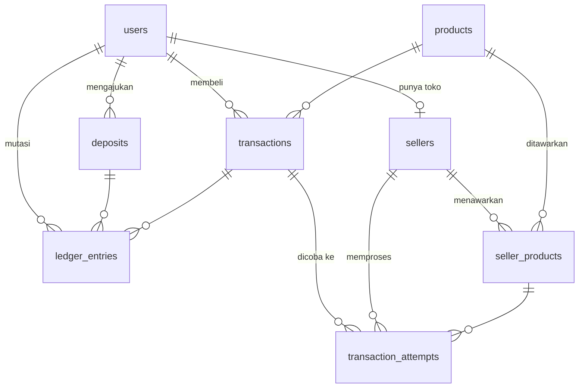

# Desain Database — Marketplace H2H PPOB (Draft v0.1)

Status: **draft untuk didiskusikan**. Database: PostgreSQL.

## Prinsip

1. **Uang = `BIGINT` rupiah**, tanpa float/desimal.
2. **Saldo hanya berubah lewat ledger.** Setiap perubahan `users.balance` wajib disertai satu baris
   `ledger_entries` dalam satu transaksi DB yang mengunci baris user (`SELECT ... FOR UPDATE`).
   Ledger bersifat append-only sehingga saldo selalu bisa diaudit.
3. **Satu akun bisa menjadi buyer sekaligus seller.**
4. **Transaksi buyer terpisah dari percobaan ke seller.** Satu transaksi bisa dialihkan ke beberapa
   seller jika gagal; setiap percobaan dicatat sebagai *attempt*.
5. **`ref_id` unik per buyer.** Request ulang dengan `ref_id` sama = cek status, bukan transaksi baru.

## Relasi

## Tabel

### `users` — akun (buyer, seller, admin)
| Kolom | Tipe | Catatan |
|---|---|---|
| id | UUID PK | |
| name | TEXT | |
| email | TEXT UNIQUE | |
| password_hash | TEXT | scrypt |
| is_admin | BOOLEAN | |
| balance | BIGINT ≥ 0 | saldo tersimpan (cache dari ledger) |
| created_at | TIMESTAMPTZ | |

### `sellers` — profil toko (1:1 dengan users)
| Kolom | Tipe | Catatan |
|---|---|---|
| user_id | UUID PK, FK users | |
| store_name | TEXT UNIQUE | |
| is_active | BOOLEAN | admin dapat menonaktifkan |
| created_at | TIMESTAMPTZ | |

### `products` — katalog master (dikelola admin)
| Kolom | Tipe | Catatan |
|---|---|---|
| id | UUID PK | |
| sku | TEXT UNIQUE | mis. `xld10` |
| name | TEXT | |
| category | TEXT | mis. Pulsa, Data, PLN |
| brand | TEXT | mis. XL, Telkomsel |
| is_active | BOOLEAN | |

### `seller_products` — penawaran seller per produk
| Kolom | Tipe | Catatan |
|---|---|---|
| id | UUID PK | |
| seller_id | FK sellers | UNIQUE (seller_id, product_id) |
| product_id | FK products | |
| seller_sku | TEXT | kode produk di sistem seller |
| price | BIGINT > 0 | harga modal seller |
| is_active | BOOLEAN | |
| success_count, failed_count | INT | dipakai untuk routing |
| created_at, updated_at | TIMESTAMPTZ | |

Index: `(product_id, price) WHERE is_active` — mencari seller termurah.

### `deposits` — isi saldo
| Kolom | Tipe | Catatan |
|---|---|---|
| id | UUID PK | |
| user_id | FK users | |
| amount | BIGINT > 0 | |
| status | `pending` / `approved` / `rejected` | |
| note | TEXT | |
| created_at, decided_at | TIMESTAMPTZ | |

### `transactions` — transaksi sisi buyer
| Kolom | Tipe | Catatan |
|---|---|---|
| id | UUID PK | |
| buyer_id | FK users | UNIQUE (buyer_id, ref_id) |
| ref_id | TEXT | dari sistem buyer |
| product_id | FK products | |
| customer_no | TEXT | nomor HP / ID pelanggan |
| max_price | BIGINT NULL | batas harga dari buyer |
| buyer_price | BIGINT | nominal yang dipotong dari saldo buyer |
| current_attempt_id | FK transaction_attempts | |
| status | `pending` / `success` / `failed` | |
| sn, message | TEXT | SN/token dari seller |
| created_at, updated_at | TIMESTAMPTZ | |

### `transaction_attempts` — percobaan ke seller
| Kolom | Tipe | Catatan |
|---|---|---|
| id | UUID PK | dipakai sebagai ref_id ke seller |
| transaction_id | FK transactions | |
| seller_id | FK sellers | |
| seller_product_id | FK seller_products | |
| seller_price | BIGINT | harga saat attempt dibuat |
| status | `pending` / `success` / `failed` | |
| sn, message | TEXT | |
| created_at, finished_at | TIMESTAMPTZ | |

### `ledger_entries` — mutasi saldo (append-only)
| Kolom | Tipe | Catatan |
|---|---|---|
| id | BIGSERIAL PK | |
| user_id | FK users | |
| type | `deposit` / `purchase` / `refund` / `sale` | |
| amount | BIGINT ≠ 0 | positif = masuk, negatif = keluar |
| balance_after | BIGINT ≥ 0 | |
| deposit_id | FK deposits NULL | |
| transaction_id | FK transactions NULL | |
| description | TEXT | |
| created_at | TIMESTAMPTZ | |

## Alur uang

Contoh: harga seller 5.000, biaya platform 100.

| Kejadian | Buyer | Seller | Platform |
|---|---|---|---|
| Transaksi dibuat | −5.100 (`purchase`) | – | – |
| Sukses | – | +5.000 (`sale`) | margin 100 (implisit) |
| Gagal → dialihkan ke seller lebih murah (4.900) | +200 (`refund` selisih) | – | – |
| Gagal → tidak ada seller lain | +5.100 (`refund`) | – | – |

## Belum tercakup (kandidat tahap berikutnya)

- Koneksi H2H: `api_credentials` (username/API key buyer, IP whitelist), `seller_connections`
  (endpoint, secret, IP), `webhook_deliveries` (callback ke buyer, log request/response ke seller).
- Pascabayar: `inquiries` (cek tagihan sebelum bayar).
- Penarikan saldo seller: `withdrawals`.
- Riwayat harga dan jam cut-off/gangguan per produk seller.
- Preferensi buyer: memilih/mengunci seller per produk.
- Akun platform di ledger agar margin tercatat eksplisit.

## Pertanyaan terbuka

1. Biaya platform: flat, persentase, atau per produk/level buyer?
2. Pascabayar masuk tahap pertama atau prabayar dulu?
3. Routing: otomatis termurah, atau buyer boleh memilih seller?
4. Deposit: persetujuan manual admin atau payment gateway?
5. Pendaftaran seller: bebas atau wajib verifikasi admin?
